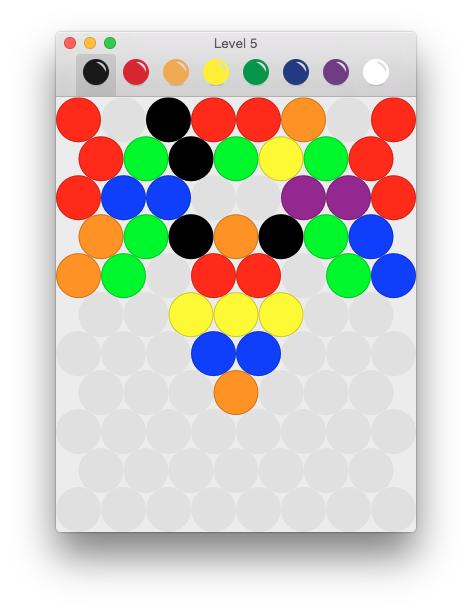

# BubbleGun Level Maker
Copyright © 2014-2015 Manuel Sainz de Baranda y Goñi.  
Released under the terms of the [GNU General Public License v3](http://www.gnu.org/copyleft/gpl.html).

### What is BubbleGun Level Maker?
It is a level editor for BubbleGun.

### Notes
In order to compile, you need to install the [Q API](http://github.com/redcode/Q) in "/usr/local/include/Q".

### History

* __[v1.2](http://github.com/redcode/BubbleGun-Level-Maker/releases/tag/v1.2)__ _(2015-07-13)_
	* Adapted to the current version of Q.
	* Fixed a bug related to the opening of documents.
	* The field's circles are painted with borders now.

* __v1.1__ _(2014-12-09)_
    * Minor improvements and bug fixes.

* __v1.0__ _(2014-11-06)_
    * Initial release.
